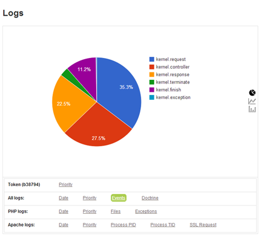

#Logboard Bundle

> Log Reporting Dashboard for Symfony2

[LogboardBundle](screen.png "LogboardBundle Screenshot")

## Installation

#### If you are working with Symfony >= 2.2

Add this in your `composer.json`

    "require-dev": {
        [...]
        "so/logboard-bundle": "1.1.*@dev"
    },

And run `php composer.phar update so/logboard-bundle`

#### Register the bundle in your AppKernel (`app/AppKernel.php`)

Most of the time, we need this bundle to be only activated in the `dev` environment

    [...]
    if (in_array($this->getEnvironment(), array('dev', 'test'))) {
        [...]
        $bundles[] = new So\LogboardBundle\LogboardBundle();
    }

## Screenshot

