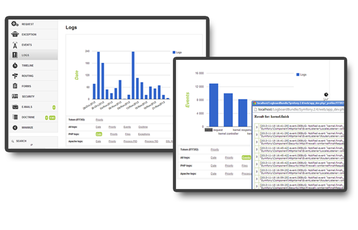
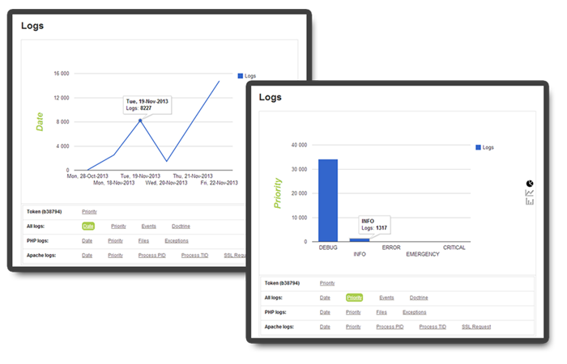
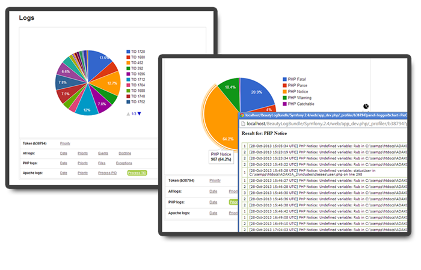

#Logboard Bundle

                                       

#### Log Reporting Dashboard for Symfony2

## Installation

Add this in your `composer.json`

    "require-dev": {
        [...]
        "so/logboard-bundle": "1.2.*@dev"
    },

And run `php composer.phar update so/logboard-bundle`

#### Register the bundle in your AppKernel (`app/AppKernel.php`)

Most of the time, we need this bundle to be only activated in the `dev` environment

    [...]
    if (in_array($this->getEnvironment(), array('dev', 'test'))) {
        [...]
        $bundles[] = new So\LogboardBundle\LogboardBundle();
    }

#### Configuration file
- Create a new file logboard.yml in app/config directory and import it into config_dev.yml
- Copy/Paste the default configuration and adapt it to your environment

  See the default configuration here: https://github.com/SofHad/LogboardBundle/blob/master/Resources/config/Logboard_config_default.yml

## Screenshot

Here is a quick look at the log reporting dashboard:

##License

This bundle is available under the [MIT license](Resources/meta/LICENSE).
